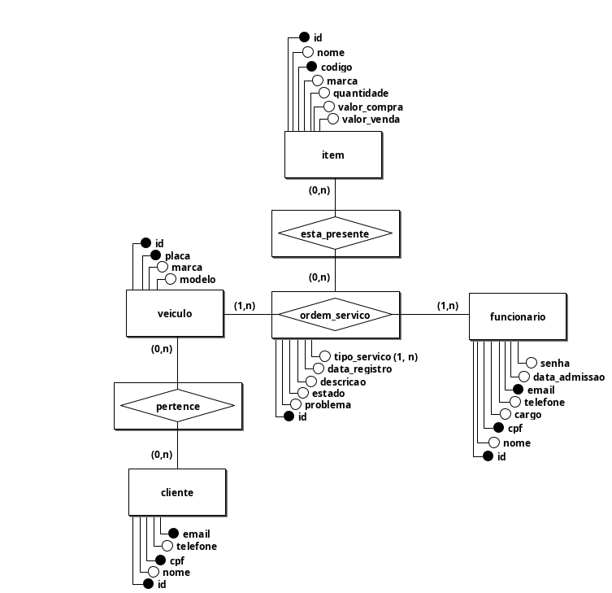
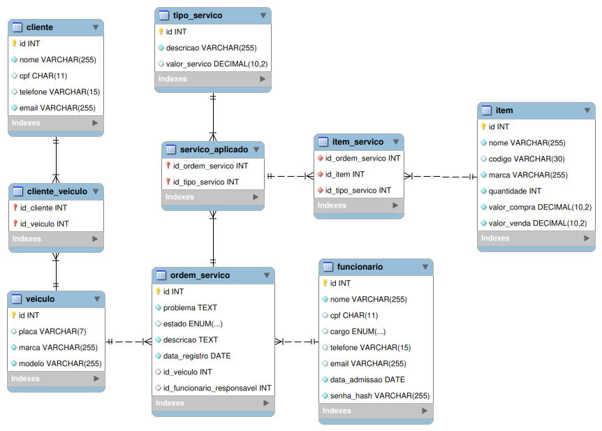

# 🔧 A Garagem — Sistema de Gestão de Oficina Mecânica

> Projeto acadêmico de sistema desktop para gestão da oficina mecânica de motos **A Garagem**.

---

## 📋 Sobre o projeto

A Garagem é um sistema desktop desenvolvido em Java que permite a gestão completa de uma oficina mecânica fictícia. O sistema identifica o tipo de funcionário logado e disponibiliza funcionalidades específicas para cada cargo, permitindo o gerenciamento de clientes, veículos, funcionários e ordens de serviço.

### Funcionalidades principais

- Autenticação de funcionários com controle de acesso por cargo (Gerente, Atendente, Mecânico)
- Cadastro e gerenciamento de clientes e seus veículos
- Cadastro e gerenciamento de funcionários
- Registro e acompanhamento de ordens de serviço
- Geração de relatório financeiro em PDF com custos e lucros dos serviços

---

## 🗄️ Modelo de banco de dados

### Modelo Conceitual



### Modelo Lógico



---

## 🏗️ Arquitetura

O projeto segue a arquitetura em camadas **MVC** estendida:

```
View (Java Swing)
    ↓
Controller
    ↓
Service (regras de negócio e validações)
    ↓
DAO (acesso ao banco de dados via JDBC)
    ↓
Banco de dados (MySQL)
```

### Estrutura de pacotes

```
src/
├── main/
│   ├── java/
│   │   ├── controllers/
│   │   ├── dao/
│   │   ├── entities/
│   │   │   └── enums/
│   │   ├── exceptions/
│   │   ├── Services/
│   │   ├── utils/
│   │   └── view/
│   └── resources/
│       └── assets/
│           └── imagens/
```

---

## 🛠️ Tecnologias utilizadas

| Tecnologia | Descrição |
|---|---|
| Java 21 | Linguagem principal |
| Java Swing | Interface gráfica |
| JDBC | Comunicação com o banco de dados |
| MySQL | Banco de dados relacional |
| Apache PDFBox | Geração de relatórios em PDF |
| Caelum Stella | Validação de CPF |
| Jakarta Mail | Envio de e-mails |
| Dotenv Java (cdimascio) | Leitura de variáveis de ambiente via `.env` |

---

## ⚙️ Pré-requisitos

- JDK 21
- MySQL
- Maven

---

## 🚀 Como executar

1. Clone o repositório:
```bash
git clone https://github.com/VictorSCDS/A-Garagem.git
```

2. Configure o arquivo `.env` na raiz do projeto com as credenciais do banco:
```env
NOME_BD=garagem # Disponivel no arquivo garagem.sql
USUARIO_BD=[NOME_DA_SUA_CONEXAO_MYSQL]
SENHA_BD=[SENHA_DA_SUA_CONEXAO_MYSQL]
LOCALHOST_BD=[LOCALHOST_DO_SEU_MYSQL]
SENHA_ADMIN=[SENHA_PARA_A_CONTA_PADRAO_DE_ADMIN_DA_GARAGEM]
EMAIL_REMETENTE=[EMAIL_QUE_ENVIARA_OS_CODIGOS_DE_SENHA]
EMAIL_SENHA=[SENHA_DO_APP_DO_EMAIL]
```

3. Execute o [script SQL](comando_sql/garagem.sql) para criar o banco de dados e popular os dados iniciais de `tipo_servico`.

4. Execute o projeto pela [classe principal](/src/main/java/main/Main.java) via sua IDE ou pelo Maven.

---

## 👨‍💻 Autores

Desenvolvido como projeto acadêmico para o 3° período do curso de **Análise e Desenvolvimento de Sistemas** pelos alunos:
- [David Willyam](https://github.com/DavidOliveira2678)
- [Lucas Leandro](https://github.com/Lucas5812)
- [Ronaldo Cesar](https://github.com/odlaanoR)
- [Victor Soares](https://github.com/VictorSCDS/)
